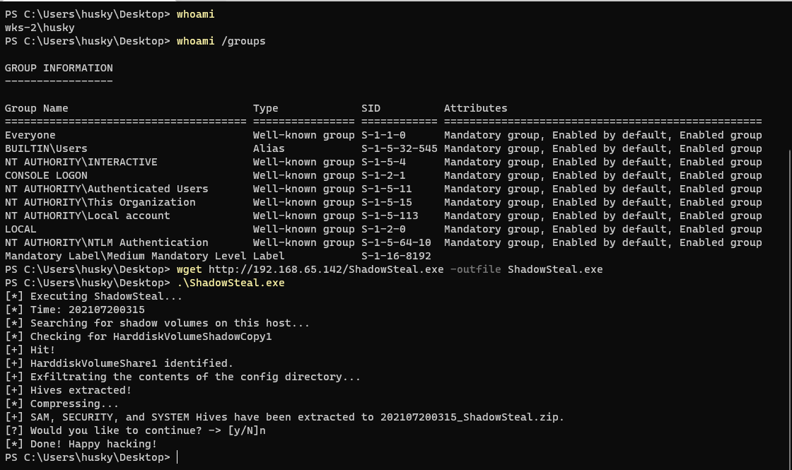

# ShadowSteal | CVE-2021-36934
Pure Nim implementation for exploiting CVE-2021-36934, the SeriousSAM Local Privilege Escalation (LPE). Nothing fancy, basically just a wrapper for PowerShell copy, but does save some time if you're triaging vulnerable hosts. Not OPSEC safe.... yet ;)

## Summary
Due to some oversight by Microsoft, regular users have read permissions over the contents of the System32\config\ folder in recent Windows builds. Among other things, this means that a low level user has read access to the SAM, System, and Security files in System32\config.


Ooof. So what can we do with this?

Some very observant researchers (shout out [@jonasLyk](https://twitter.com/jonasLyk)!) noticed that if a Windows host has been using a specific system restore configuration, "Shadow Volume Copy", then the host stores backup copies of these files that are accessible via the Win32 device namespace for these copies.


The SAM is normally locked during the host's operation, so accessing the SAM in System32\config\ is out of the question. But these shadow volume copies are fair game for any user on the host due to this misconfiguration.

## ShadowSteal

ShadowSteal is a binary written in Nim to automate the enumeration and exfiltration of the SAM, System, and Security files from these shadow copies. It iterates through the possible locations of the shadow copies and, when it has found a target, it extracts the files to a zipped directory (think Bloodhound output).

It's currently hard coded to iterate 10 times through "HarddiskVolumeShadowCopy[#]" directory until it finds a hit. Future build may include adding cmd line arguments to expand this, but I think 1-10 should be good for POC purposes.



It's nothing earth shattering and the code is hacky, but it works and it was a fun build!

## Setup & Run

Install Nim:
```
$ sudo apt-get install nim
````
Install dependencies:
```
$ nimble install zippy
```
Compile for 64-bit Windows:
```
$ nim c --d:mingw --cpu=amd64 --app=console ShadowSteal.nim
```
Transfer to target and run it!
```
PS C:\Users\husky\Desktop> .\ShadowSteal.exe
```
Then, transfer the output directory back to your attacker host and carve the data with Pypykatz. To install:
```
$ pip3 install pypykatz
```
To run Pypykatz:
```
$ pypykatz registry [yyyyMMddhhmm_SYSTEM] --sam [yyyyMMddhhmm_SAM] --security [yyyyMMddhhmm_SECURITY]
```


## References
- Original disclose of this CVE by by [@jonasLyk](https://twitter.com/jonasLyk).
- [CVE Reference page](https://msrc.microsoft.com/update-guide/vulnerability/CVE-2021-36934)

## Disclaimer
- For legal, ethical use only.
